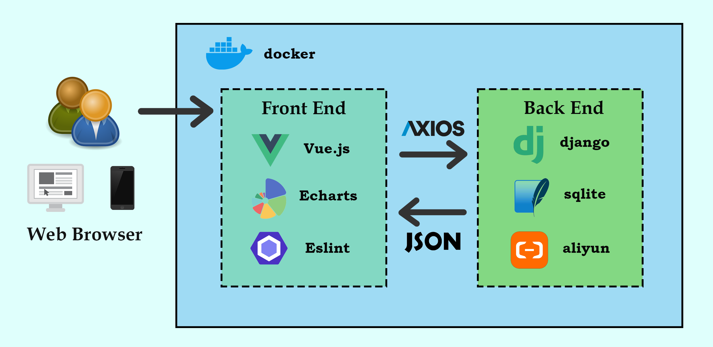

# SJTUer
简体中文 | [English](README.md)

     

SJTUers（上海交通大学学生门户系统）为非官方网站应用。本应用的目的在于为交大学生开发个性化一站式主页，集成交大常用与生活常用为一体。

## 背景
目前的国内首页情况堪忧：
- 常见的默认主页广告横行且不实用，例如[hao123](https://www.hao123.com/?from=hao123)，[2345](https://www.2345.com/)，[360](http://se.360.cn/wz.html)；
- 默认的搜索引擎可以实现功能过少（仅能用于检索），并且UI个性化不足；
- 交大学生在访问交大常见网址时，往往需要通过记忆网址或加入收藏夹的形式，且查询不同交大相关资料时往往需要在不同网站寻找，这极大地浪费了无数交大学子的时间。

与现有相似门户系统相比：
- 目前已有人开发简洁、实用的门户系统，但是个性化不足仍未解决，例如[简约导航](https://www.jianavi.com/)；
- 当下友校已搭建出了该校学生个性化使用的门户系统——[ZJUers轻首页](https://zjuers.com/)，其具有域名简单、界面简约、功能齐全的特点，但其个性化仅为学校个性化，我们希望能够搭建一个用户单位个性化的首页。

## 功能

- [x] 交大常用网址索引，如教务处、教学信息服务网、canvas、邮箱等；
- [x] 用户模块，支持Jaccount登录，并可以同步用户个性化设置的网址等数据；
- [x] Todolist组件，记录用户的任务清单，支持设置任务类别、优先级;
- [x] 资讯组件，包括教务处通知公告、交大新闻、微博、知乎、bilibili热搜实时信息，使用异步编程实现爬虫；
- [x] 天气组件，包括实时天气与3日天气预告，可自定义当前城市；
- [x] 人流量组件，包括食堂、图书馆实时数据信息可视化；
- [x] 搜索引擎，可以在百度、必应、谷歌等常用搜索引擎中切换；
- [x] 每日诗词，随着每次刷新在网页底部更新一句诗词；
- [x] 时钟组件，实时翻页进行动态展示；
- [x] 简洁模式，点击时钟组件可以自动切换简洁模式开关，简洁模式下展示优先级最高的todolist；
- [x] 壁纸，用户可以在壁纸库中选择也可以上传自己的壁纸，并与用户同步；
- [x] AI文字转图片，可以在设置壁纸时输入一段文字描述希望展示的壁纸内容，依据内容自动生成壁纸。

## 使用方式

本项目使用[vue](https://cn.vuejs.org/), [Echarts](https://echarts.apache.org/en/index.html) & [Eslint](https://eslint.org/)构建前端，使用[django](https://www.djangoproject.com/), [sqlite](https://www.sqlite.org/index.html) & [aliyun](https://www.alibabacloud.com/en)构建后端，前端采用[axios](https://axios-http.com/)向后端发起请求获取数据。工作流程图如下：


运行方式如下：

进入 `/django` 目录下：
```
pip install -r requirements.txt
python3 manage.py migrate
python3 manage.py runserver
```

进入 `/vue` 目录下：
```
npm clean cache -f
npm install
npm run build
```

按终端提示访问 `localhost:5173/` 即可。

输出的png图片可以在 `/result` 目录下看到。

## 如何贡献
非常欢迎你的加入！[提一个 Issue](https://github.com/young1881/SJTUer/issues/new) 或者提交一个 Pull Request。

### 贡献者
感谢以下参与项目的人：
[herfst77](https://github.com/herfst77), [joyiee](https://github.com/joyiee), [zhanzh0331](https://github.com/zhanzh0331), [Suvanka](https://github.com/Suvanka), [Zhangky11](https://github.com/Zhangky11), [young1881](https://github.com/young1881)

## 协议
[MIT](LICENSE) &copy; Wortox Young