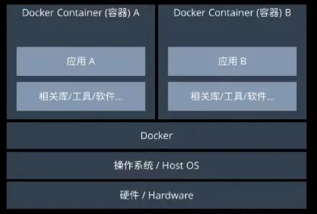
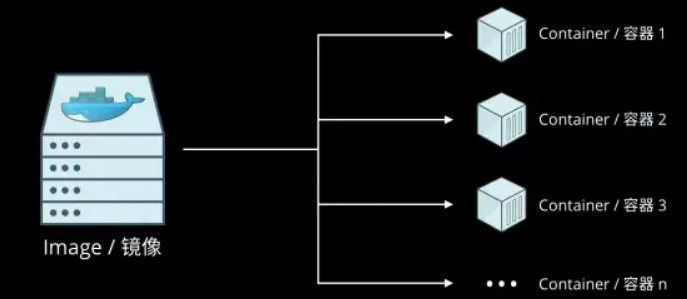

# 测试与部署文档

## 测试

### 背景与目的

由于本项目前后端分离，前端采用vue框架进行组件化开发，后端采用django实现各应用组件化开发，各开发组件模块相对独立，故采取的测试方式为：

- 在开发单个组件过程中，需要依据组件间接口需求，进行单元测试。
- 在完成相对独立的一个组件后，进行手动集成测试与确认测试。
- 在整体项目迭代完成时，进行验收测试。

### 测试环境

在后端中的测试主要依赖 Python 的标准模块 `unittest`， 它支持测试自动化、共享测试的设置和关闭代码、将测试聚合到集合中以及测试与报告框架的独立性。

###  相关人员

由张可言负责前端测试工作，杨伟程负责后端测试工作。

### 测试范围

后端中的单元测试范围如下：

- 数据库结构测试
- 数据库增删改查操作测试
- 模拟axios发起GET请求数据库内容
- 模拟axios发起GET请求爬虫数据内容
- 模拟axios发起GET请求后端媒体资源内容
- 模拟axios发起POST请求后端数据库内容
- 模拟axios发起POST请求后端数据库操作

组件集成测试范围为：

- 时钟组件测试
- 搜索引擎组件测试
- 网页组件测试
- Todolist组件测试
- 资讯组件测试
- 天气组件测试
- 人流量组件测试
- 壁纸组件测试
- 每日诗词测试
- 简洁模式测试
- 运行时间测试
- 安全攻击测试

### 测试时间

|      测试任务      | 计划时间  | 实际时间  |
| :----------------: | :-------: | :-------: |
|    前端单元测试    | 2023-5-24 | 2023-5-25 |
|    后端单元测试    | 2023-5-23 | 2023-5-24 |
| 集成测试与确认测试 | 2023-5-26 | 2023-5-26 |
|      系统测试      | 2023-5-27 | 2023-5-27 |


### 测试结果

后端单元中共编写了17个测试函数，每个函数包括可能的测试用例，主要在 `django/index/test.py` 中，在2.595s内得出所有测试结果，符合运行时间的测试预期。

在集成测试与确认测试、系统阶段中，项目能够按照需求与设计预期运行。

### 测试结构与缺陷分析

本项目对核心功能需求进行全面的测试，能够在合理的运行时长中得到预期的效果。

测试中仍存在一些缺陷：

- 未能测试不同版本硬件、不同版本软件包是否能够支持项目运行；
- 未能模拟真实的高数量级访问量以测试服务器运载能力；
- 未能测试在未来可能存在的API改变而导致的报错。


## 部署

### 环境

|      名称          |    版本     |
| :----------------: | :-------: |
| Python | 3.10  |
| Django | 4.0.2 |
| Vue | 3.3.4 |
| Node.js | 18.16.0 |
| Npm | 9.5.1 |

### Docker概述

Docker是一个开源的应用容器引擎，基于Go语言开发，能够让开发者打包他们的应用以及依赖环境到一个轻量级并且可移植的容器中，然后迁移到任何Linux服务器（对于Windows系统，如果安装了WSL，也可以进行迁移）。

Docker的架构如下：



Docker在概念上与虚拟机非常类似。但是Docker更轻量，它不会去模拟底层的硬件，只会为每一个应用提供完全隔离的运行环境。从上图可以看出，Docker实际上是位于Host OS和上层应用之间的一个抽象层。

包含上层应用及其依赖环境的结构称为容器（Container），可以在容器中配置不同的应用环境，不同环境之间互相不影响。

Docker有两个比较关键的概念：

* 镜像（Image）：Docker的镜像可以同虚拟机的镜像进行类比，其中包含了应用程序、依赖库、环境变量等等运行所必需的静态数据。镜像一经创建，其内容不会发生变化。
* 容器（Container）：Docker的容器可以类比为使用镜像创建的虚拟机实体，其中运行着应用程序，其内容是动态的，会随时发生变化。

镜像和容器的关系如下所示：



镜像可以类比为面向对象程序设计中的类，而容器就是类进行实例化之后的对象。基于某个镜像，可以创建多个容器。

Docker部署和发布的一般化流程：


* 开发者在本地完成应用开发；
* 开发者编写Dockerfile等配置文件，拉取公有仓库中的常用镜像，并在此基础上创建自己应用程序的镜像；
* 开发者通过Docker push方法，将自己制作的镜像发布到自己的镜像仓库中；
* 其他用户从该开发者仓库拉取指定镜像，并且创建容器，即可运行开发者的应用。

### Docker双容器部署

由于本项目为前后端分离架构，因此需要借助双容器进行部署，前后端进行数据交互时访问指定的端口即可。

**前端部署**

当前vue文件夹下的文件都是开发时用到的文件，首先需要对vue项目进行打包。

```shell
npm run build
```

上述命令运行完毕之后，vue项目的根目录下会出现`dist/`目录，存放网页静态文件。然后，将本项目中用到的一些静态文件（主要是图片）复制到`dist/`目录下，便于直接调用。

接下来编写Dockerfile，给出镜像的配置：

```dockerfile
# 拉取轻量级的node alpine镜像进行配置
FROM node:lts-alpine  
  
RUN npm install -g http-server  

# /app 目录为工作目录
WORKDIR /app  

# 将package配置文件复制到工作目录下 
COPY package*.json ./  

# 安装依赖库 
RUN npm install  
RUN npm install axios

# 把vue的整个项目文件夹复制到工作目录中 
COPY . .  

# 指明镜像在实例化成容器之后，后台运行的命令
# 需要注意的是，必须将vue项目的运行地址修改为0.0.0.0，否则无法在容器外访问
CMD [ "yarn", "run", "dev", "--host", "0.0.0.0" ]
```

接下来就是根据Dockerfile创建镜像，并且上传到Docker hub的个人仓库中。

```shell
# 根据Dockerfile创建镜像，命名的规范格式为 用户名/镜像名
docker build -t kyrie11zhang/sjtuer_vue .

# 将创建的镜像上传到个人仓库中，个人仓库名必须与用户名一致
docker push kyrie11zhang/sjtuer_vue:latest
```

至此，Docker镜像已经创建和上传完毕，如果其他用户要使用该镜像，可以从个人仓库拉取镜像并且创建容器运行。

```shell
# 从个人仓库中把镜像拉取到本地
docker pull kyrie11zhang/sjtuer_vue

# 基于kyrie11zhang/sjtuer_vue镜像创建名为sjtuer_frontend的容器并且运行
# 将宿主机的端口5173与容器的5173端口建立映射，即访问前端项目时只需要访问 http://localhost:5173
docker run -it -d --name sjtuer_frontend -p 5173:5173 kyrie11zhang/sjtuer_vue
```

此时，容器已经开始运行，命令`yarn run dev --host 0.0.0.0`已经在后台运行，前端项目成功启动。

**后端部署**

后端项目的部署在整体流程上同前端一致，但是需要有一些前置的配置。

首先，为了部署之后能够访问到后端项目，需要在Django项目的`setting.py`文件中将ALLOWED_HOSTS变量设置为服务器的实际对外地址。

其次，运行Django需要配置相关的python环境及其依赖包，因此需要生成`requirements.txt`文件。此处采用`pipreqs ./ --encoding=utf8`命令生成相关的依赖库，该命令与`pip freeze > requirements.txt`的区别在于，前者仅仅生成与当前项目相关的依赖库，而后者会将当前环境的所有库都导出。

最后，为了在创建Docker镜像时，加快pip安装包的速度，需要配置`pip.conf`文件，修改pip安装的镜像源。

完成前置准备工作之后，编写Dockerfile

```Dockerfile
 # 建立 python3.10 环境
 FROM python:3.10

 # 设置 python 环境变量
 ENV PYTHONUNBUFFERED 1

 # 设置pip源为国内源
 COPY pip.conf /root/.pip/pip.conf

 # 在容器内/var/www/html/下创建 mysite1文件夹
 RUN mkdir -p /var/www/html/sjtuer

 # 设置容器内工作目录
 WORKDIR /var/www/html/sjtuer

 # 将当前目录文件加入到容器工作目录中（. 表示当前宿主机目录）
 ADD . /var/www/html/sjtuer

 # 利用 pip 安装依赖
 RUN pip install -r requirements.txt
 RUN rm db.sqlite3
 RUN python manage.py makemigrations
 RUN python manage.py migrate

 # 指明镜像在实例化成容器之后，后台运行的命令
 # 需要注意的是，必须将Django项目的运行地址修改为0.0.0.0，否则无法在容器外访问
 CMD ["python", "manage.py", "runserver", "0.0.0.0:8000"]
```

后续的创建镜像、上传镜像以及拉取镜像、创建容器并运行等命令，同前端完全一致，此处直接给出：

```shell
# 根据Dockerfile创建镜像，命名的规范格式为 用户名/镜像名
docker build -t kyrie11zhang/sjtuer_django .

# 将创建的镜像上传到个人仓库中，个人仓库名必须与用户名一致
docker push kyrie11zhang/sjtuer_django:latest

# 从个人仓库中把镜像拉取到本地
docker pull kyrie11zhang/sjtuer_django

# 基于kyrie11zhang/sjtuer_django镜像创建名为sjtuer_backend的容器并且运行
# 将宿主机的端口8000与容器的8000端口建立映射，即前端项目需要获取后端数据时候，只需要访问 http://localhost:8000
docker run -it -d --name sjtuer_backend -p 8000:8000 kyrie11zhang/sjtuer_django
```

此时，容器已经开始运行，命令`python manage.py runserver 0.0.0.0`已经在后台运行，后端项目成功启动。

至此，双容器部署已经完成，访问`http://localhost:5173`，即可访问我们开发的Web项目。

值得注意的是，上述是开发者进行部署的流程，如果其他用户需要使用，只需要在本地已安装Docker环境的前提下，运行Docker pull和Docker run命令即可，如下所示：

```shell
# 从个人仓库中把前端镜像拉取到本地
docker pull kyrie11zhang/sjtuer_vue

# 基于kyrie11zhang/sjtuer_vue镜像创建名为sjtuer_frontend的容器并且运行
# 将宿主机的端口5173与容器的5173端口建立映射，即访问前端项目时只需要访问 http://localhost:5173
docker run -it -d --name sjtuer_frontend -p 5173:5173 kyrie11zhang/sjtuer_vue

# 从个人仓库中把后端镜像拉取到本地
docker pull kyrie11zhang/sjtuer_django

# 基于kyrie11zhang/sjtuer_django镜像创建名为sjtuer_backend的容器并且运行
# 将宿主机的端口8000与容器的8000端口建立映射，即前端项目需要获取后端数据时候，只需要访问 http://localhost:8000
docker run -it -d --name sjtuer_backend -p 8000:8000 kyrie11zhang/sjtuer_django
```

