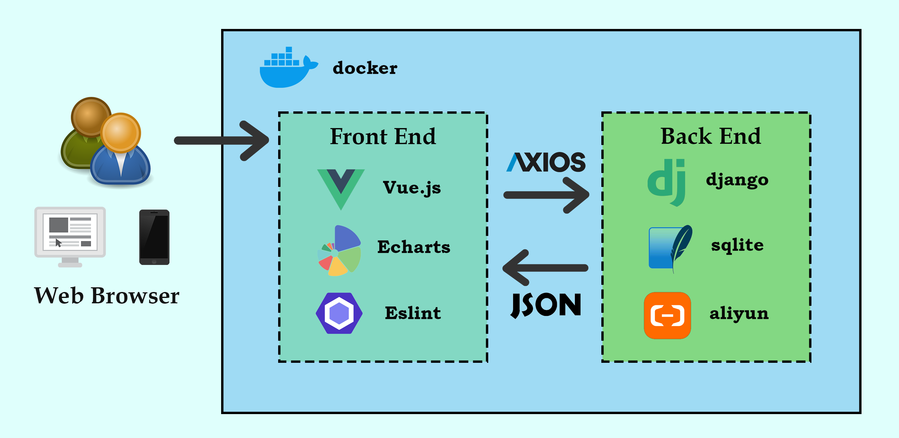

# 设计文档
## 项目架构


## 环境依赖


## git版本管理

### 代码管理
Git作为是一个开源的分布式版本控制系统，可以有效、高速地处理从很小到非常大的项目版本管理。Git支持版本库本地化，支持离线提交，相对独立不影响协同开发；同时支持快速切换分支方便合并，比较合并性能好。故而我们组使用Git管理代码。

### 分支管理
本项目的主分支为master分支，其余各分支以组员的名字命名。各位组员开发完一定的功能之后，先上传到自己的远程仓库分支进行备份；如果该功能已基本完成，或者其他成员的功能需要基于该功能进行开发，则将自己的分支merge到master分支。各位成员将从master分支拉取最新的代码。因此，master分支是用于汇总完善功能的分支，而自己的分支则主要起备份作用。


## 前端组件设计

### 组件1

### 组件2

### 组件3

## 后端结构设计

### 爬虫获取数据

#### 资源获取

在本次项目中需要获取网络公开的资源数据：教务处通知公告、交大新闻、知乎热搜、微博热搜、B站热搜、食堂数据、图书馆数据等。首先需要通过开发者工具调取相关数据接口以发送请求，并针对html、json、xml不同格式进行内容提取。

#### 提升运行效率

考虑后端采用python语言编写可能导致运行速度较慢，同时顺序访问各资源会造成大量的时间浪费，故考虑设计python3.5版本后出现的异步功能实现多线程池工作。

### ORM数据库模型

#### 数据库设计

针对项目中的开发需求，设计数据库结构E-R图如下：


考虑本项目为小型工程项目，为提升运行效率采用轻便的SQLite作为后台数据库管理。

### 数据库操作

为避免直接编写SQL语句导致可能的SQL注入问题（详见“安全需求设计”），采用django中的Model层进行ORM操作，针对前端发起的修改数据库内容的请求，编写相应的数据表内容查找、增加、修改、删除操作。

### API调取与数据处理

为便于前端不同组件的调用，后端需针对 `GET` 请求和 `POST` 请求编写对应的后端API，同时考虑前端对于数据内容获取的需求，需要将资讯信息和数据库信息统一整理为JSON格式作为前端请求的响应。

### 文字转图片组件

## 安全需求设计

### CSRF攻击防范

在django中采用 `django.middleware.csrf.CsrfViewMiddleware` 中间件防范可能出现的CSRF攻击，同时对业务中运行的必要请求视图添加 `@csrf_exempt` 注释以免除中间件的保护，这部分的防范在前端实现。

在前端，对于业务中的必要请求通过正则表达式拦截器防范CSRF攻击，具体代码如下：

```
axiosInstance.interceptors.request.use((config) => {
  config.headers['X-Requested-With'] = 'XMLHttpRequest'
  const regex = /.*csrftoken=([^;.]*).*$/
  config.headers['X-CSRFToken'] = document.cookie.match(regex) === null ? null : document.cookie.match(regex)[1]
  return config
})
```

### SQL注入防范

在django中不直接使用SQL语句进行数据库的访问，而是使用对象关系映射（Object Relational Mapping）来做数据的增删改查。ORM框架在运行时就能参照映射文件的信息，把对象持久化到数据库中，从而有效地避免了SQL注入攻击。

### 点击劫持防范

现代浏览器尊重 `X-Frame-Options HTTP` 头，它表明是否允许在框架或 `iframe` 中加载资源。如果响应包含值为 `SAMEORIGIN` 的头，那么只有当请求来自同一个网站时，浏览器才会在框架中加载资源。如果头被设置为 `DENY`，那么无论请求是由哪个网站发出的，浏览器都会阻止资源在框架中加载。

在django中，使用一组可用于覆盖中间件或仅为某些视图设置头的视图装饰器。这样，`X-Frame-Options HTTP` 头只有在响应中还没有出现的情况下，才会被中间件或视图装饰者设置。

django中采用 `django.middleware.clickjacking.XFrameOptionsMiddleware` 即可为网站的所有响应设置相同`X-FrameOptions` 值